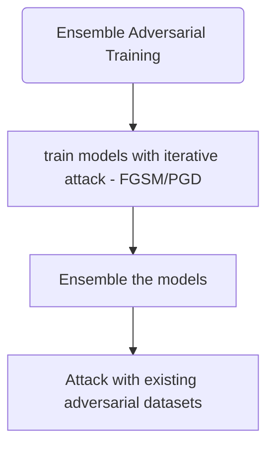

```mermaid
flowchart TD
topic(Ensemble Adversarial Training)
topic --> 1[train models with iterative attack - FGSM/PGD]
--> 2[Ensemble the models]
--> 3[Attack with existing adversarial datasets]


```